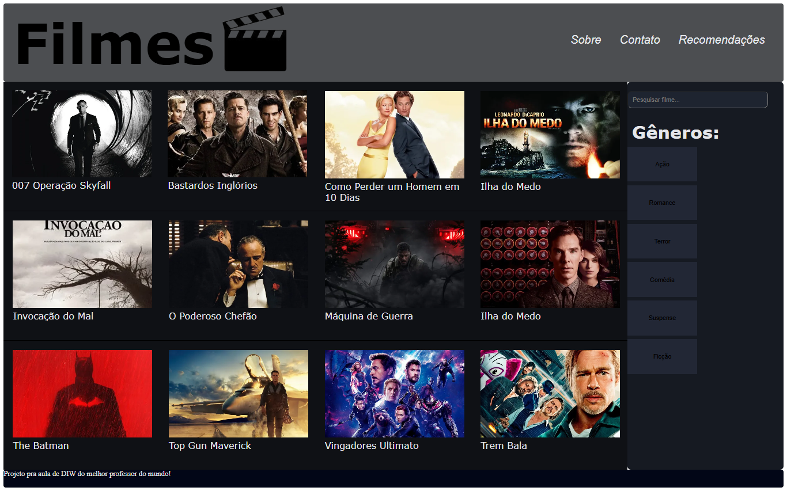

# Trabalho Prático - Semana 04

Dessa vez, vamos escolher uma proposta de projeto para trabalhar.

Nessa atividade, você deverá montar a página inicial do projeto escolhido, a organização do HTML aplicando semântica correta e uso aprimorado do CSS. Leia o enunciado completo no Canvas para mais detalhes.

**IMPORTANTE:** Você deve trabalhar e alterar apenas arquivos dentro da pasta **`public`**. Deixe todos os demais arquivos e pastas desse repositório inalterados. **PRESTE MUITA ATENÇÃO NISSO.**

## Informações Gerais

- Nome: Guilherme Gonçalves Meireles
- Matricula:911985
- Proposta de projeto escolhida: Site sobre filmes
- Breve descrição sobre seu projeto: Basicamente eu gosto muito de asssitir filmes e usei como tema pra apresentar alguns filmes que eu gosto de temas variados e apresentar um pouco sobre no meu projeto, inspirado em sites famosos de filmes e etc.

## Print do(s) wireframe(s) criado

<< .jpeg>) >>

## Print da home-page criada

<<  >>

